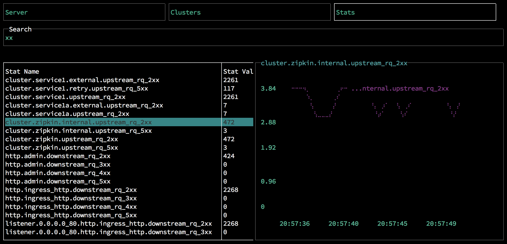

# Envoy-Curses

Welcome to Envoy-Curses, the most textual observability solution for the Envoy
proxy. Before you start, you'll need

1. a working Envoy install. I highly recommend using
   the
   [examples](https://github.com/envoyproxy/envoy/tree/master/examples/zipkin-tracing) from
   the Envoy project. They use docker-compose to set up some nice examples. You
   can also use [wrk](https://github.com/wg/wrk) as a load driver to run through
   examples.
2. npm or yarn

# Building

* install dependencies using `npm install` or `yarn install`
* run the linter if you like, with `yarn lint`

# Running

* run with `node src/index.js [stats endpoint] [polling frequency]`, e.g.
  `node src/index.js http://localhost:9999`
  
# Architecture

The application uses the [blessed](https://github.com/chjj/blessed) and
[blessed-contrib](https://github.com/yaronn/blessed-contrib) libraries to
provide a graphical, terminal-based interface to Envoy's admin server. Currently
it uses the `/clusters` and `/stats` endpoints. It polls for data on a
configurable interval, keeping a ring buffer in memory for every stat (warning:
memory is not free, and in this program, not carefully monitored).

# Usage

* This isn't an escape room. Quit with ctl-c.
* The app is organized into three views.
** The Server view shows stats about the Envoy process itself
** The Cluster view shows information about configured clusters.
** The Stats view provides an interface for arbitrary stats
* Navigate between views with left and right arrow keys

## Server

No interaction is possible. View the available data, or move to another screen.

## Cluster

* navigate screens with left and right arrow keys
* on clusters screen, select clusters with up and down arrow keys. Pressing
  enter changes stats to the currently selected cluster.
* press `/` or `?` to bring up stats selector. Enter selects a new stat to chart.

## Stats

* type characters to filter stat names. Use up/down arrows to select stat to
  chart
* backspace clears a single character from your filter
* escape will clear them all

  
